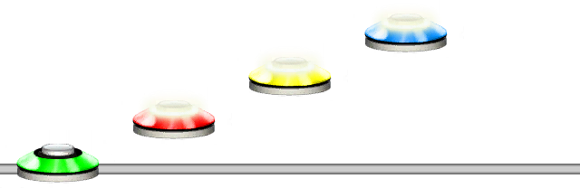
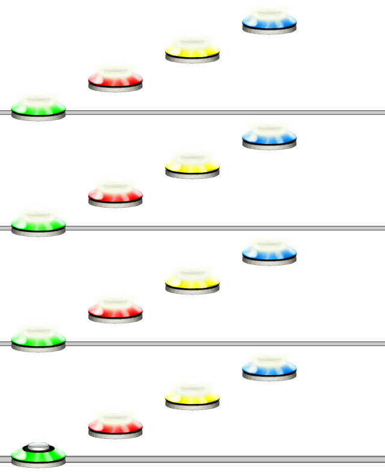

# Pattern
## Overview
The Pattern command generates an image representation of a Guitar/Clone Hero chart. It uses @Guides.Unilang as the language.

Pattern can extend beyond the traditional 5 frets by using 6-9 or A-Z characters. Drums/GHL visuals are not supported.

## Arguments
| Name        | Type        | Options           | Description                                                        |
| ----------- | ----------- | ----------------- | ------------------------------------------------------------------ |
| Input       | String      | N/A               | The input string to be parsed as Unilang and outputted as a chart. |

## Usage
> [!NOTE]
> Double quotes (" ") are not required for arguments. They are used here only to show the separation of different arguments.

### Example 1
```bash
/pattern input:"1234"
```
Will output a chart with Green, Red, Yellow, Blue.



### Example 2
```bash
/pattern input:"ARP(1234, 4)"
```
Will arpeggiate the pattern "1234" a total of 4 times.

