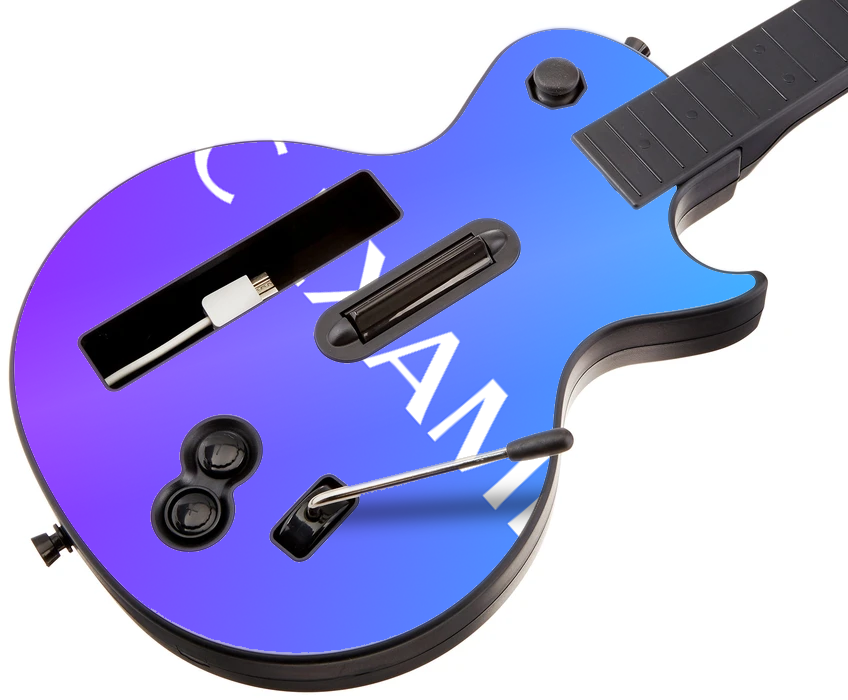
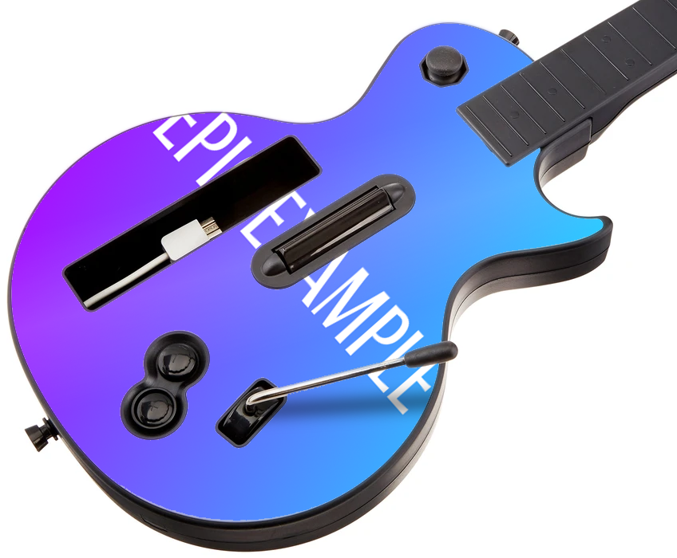

# Faceplate
## Overview
The Faceplate command will place the supplied image onto the faceplate of a Les Paul guitar. The image will be scaled, and rotated to fit.

## Arguments
| Name        | Type        | Options           | Description                                                                 |
| ----------- | ----------- | ----------------- | --------------------------------------------------------------------------- |
| Url         | String      | N/A               | The URL of the image to put onto the faceplate.                             |
| Image       | Attachment  | N/A               | An image attachment which will be used to place onto the faceplate.         |
| Resize Mode | Choice      | Crop, Stretch     | Decides how the image will be resized onto the faceplate. Default is 'Crop' |

## Usage

### Example 1
```bash
/faceplate url:"https://example.com/myimage.png"
```
Will place the image located at `https://example.com/myimage.png` onto the faceplate.

### Example 2
```bash
/faceplate image:"Discord Image Attachment"
```
Will place the image attached with the command in Discord onto the faceplate.

### Example 3
```bash
/faceplate url:"https://example.com/myimage.png" resizemode:"Crop"
```
Will crop the image located at `https://example.com/myimage.png` onto the faceplate.

### Example Image


#### Example Result 1
```bash
/faceplate resizemode: Crop
```
Using the command with this image and Resize Mode Crop will produce the result below:



#### Example Result 2
```bash
/faceplate resizemode: Stretch
```
Using the command with this image and Resize Mode Stretch will produce the result below:

