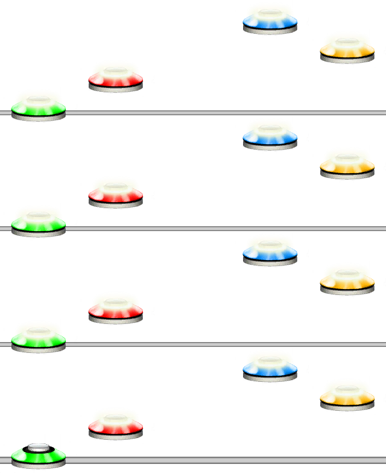
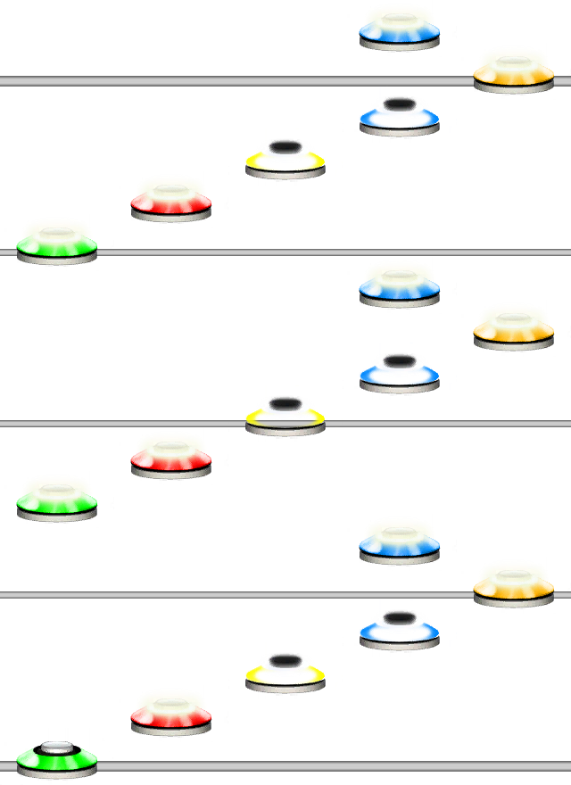

# Arpeggiator
### Aliases
`ARPEGGIATOR`, `ARP`, `A`

## Overview
The Arpeggiator function will loop through the input pattern as many times as specified.

## Arguments
| Name        | Type        | Description                      |
| ----------- | ----------- | -------------------------------- |
| Pattern     | string      | The pattern to arpeggiate.       |
| Count       | integer     | How many times to arpeggiate it. |

#### Example 1
```css
ARP(1254, 4)
```
Will arpeggiate the pattern "1254" a total of 4 times.



#### Example 2
Any state changes done in the middle of the Arpeggiator will revert back on each loop repetition.
This means that if you put a TAP function in an Arpeggiator, it will only make the notes you specify tap notes.
```css
ARP(12TAP(34)54, 3)
```

