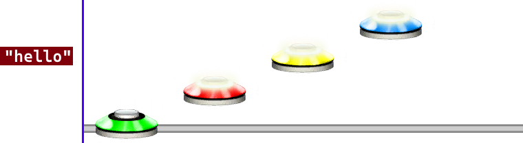

# Chart Event
### Aliases
`CHARTEVENT`, `GLOBALEVENT`, `CE`, `GE`

## Overview
The Chart Event function will create a chart event at this point.

## Arguments
| Name        | Type        | Description                                   |
| ----------- | ----------- | --------------------------------------------- |
| Event name  | string      | The name of the event to place at this point. |

> [!Tip]
> Chart Event is the exact same as a "Global Event" in MoonScraper.

#### Example
```css
12CE("hello")34
```
This will create a Chart Event with name "hello" at the same location as the note with value 3 (yellow) after.



> [!Note]
> This example image does not represent what the /pattern command will output. It's just an example showing where the chart event will go.