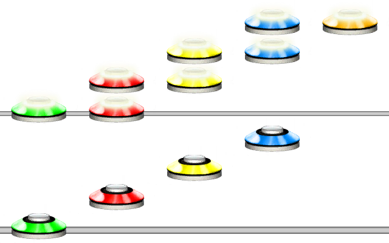

# Force
### Aliases
`FORCE`, `F`

## Overview
The Force function will force all the notes in the given pattern. Forcing will follow normal Clone Hero rules.
If the note would have been a strum, it will become a HOPO and vice versa.

## Arguments
| Name        | Type        | Description                  |
| ----------- | ----------- | ---------------------------- |
| Pattern     | string      | The pattern to force.        |

#### Example 1
```css
FORCE(1234[12][23][34][45])
```
The example shows what happens when forcing HOPOs and strum notes.



> [!NOTE]
> The first note in any chart will always be a strum unless it is a tap.