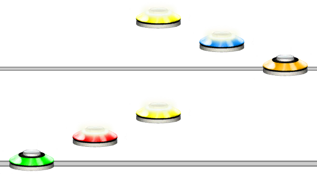
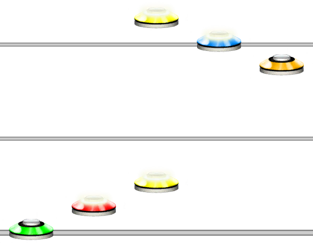
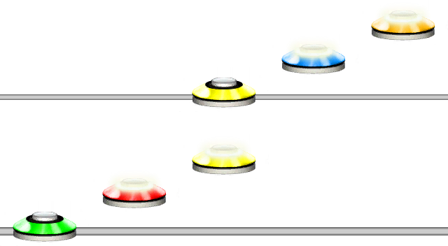
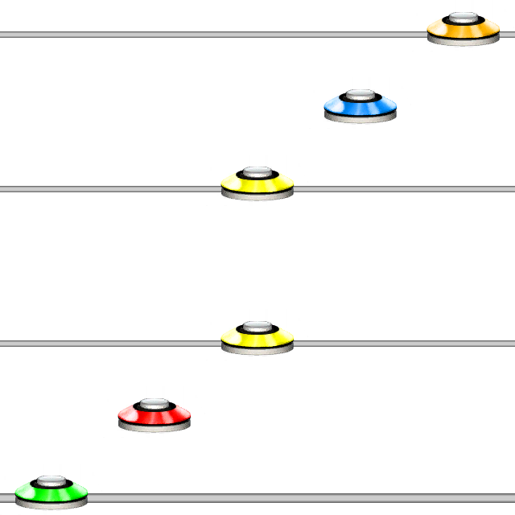

# Jump Step
### Aliases
`JUMP_STEP`, `JS`

## Overview
The Jump Step function moves the chart forward in steps equal to the quantization. Functionally, this is identical to using a `-` dash.
It will jump forward by the current amount of steps, step distance being whatever the quantization/step is at this point.

## Arguments
| Name                   | Type        | Description                                       |
| ---------------------- | ----------- | ------------------------------------------------- |
| StepCount *(optional)* | integer     | The amount of steps to jump forward. Default is 1 |

> [!NOTE]
> If step count is empty `JS()`, it will jump 1 step.
> If step count is less than 1, I.e. `JS(0)`, it will not jump at all.

> [!TIP]
> Default quantization is 1/16, so unless a different quantization is specified, Jump Step will always jump in intervals of 1/16.
> See @Guides.Unilang.Quantization for more information about quantization.

#### Example 1
```css
123JS()543
```
This will jump 1 step forwards after the first yellow note.



#### Example 2
```css
123JS(4)543
```
This will jump 4 steps forwards after the first yellow note.



## Using Dashes

Using a `-` dash serves as a short-hand for the Jump Step function, and will jump 1 step.

#### Example 3
```
123-345
```
This shows shorthand Jump Step with `-` and will jump 1 step after the first yellow note.



> [!TIP]
> Multiple dashes in a row will behave like one might expect. Two dashes `--`, will jump two steps, `---` will jump three steps, and so on.

## Different Quantizations

Using different quantizations will change the behaviour. See @Guides.Unilang.Quantization for more information about quantization.

#### Example 4
```
|8|123-345
```
Jump step in quantization 1/8.

