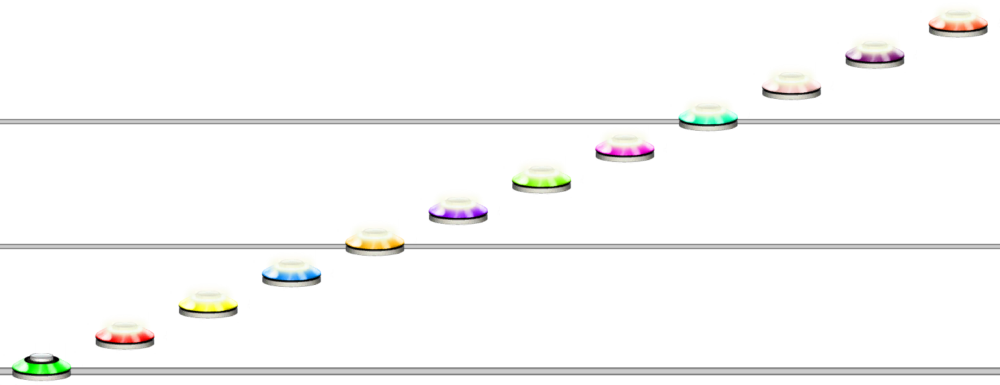
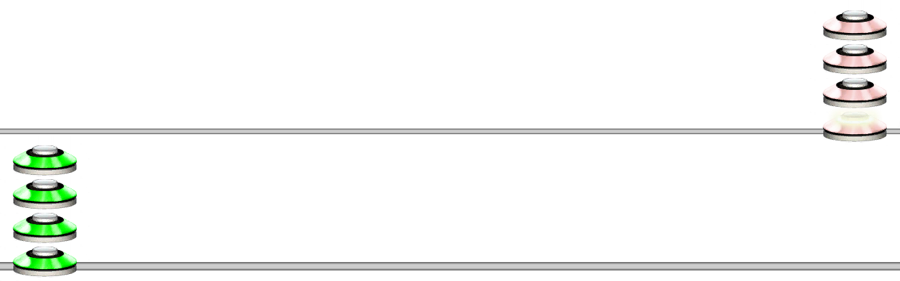
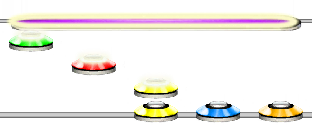

# Note
### Aliases
`NOTE`, `NT`, `🎵`, `♩`

## Overview
The Note function is the base note creation function. 
Using numbers 0-9 or lowercase letters a-z, will yield the same result as using the Note function (without Length and Type parameters.)

## Arguments
| Name                | Type        | Description                      |
| ------------------- | ----------- | -------------------------------- |
| FretValue           | integer     | The fret value of this note.     |

## Fret Value
The fret will be defined as follows:

| Input                      | Value                     |
| -------------------------- | ------------------------- |
| any integer value          | The value given           |
| `ZGRYBOPLMT` or `0 - 9`    | 0 - 9 *(0 is open note)*  |
| `a - z`                    | 10 - 35                   |

## Examples

#### Example 1
```css
NOTE(1)
```
A note of value 1, being a green note. Using "`G`" for the fret value also works in the Note function.


#### Example 2
```css
NOTE(1)NOTE(10)
```
A note with value 1 followed by a note with value 10. `a` also works to define value 10.


## Alternate Ways of Writing Notes
Writing a `NOTE` function for every note becomes cumbersome and tedious, therefore, Unilang will interpret numbers 0-9 and letters a-z as notes with values 0-35.
If you want notes above 35 for some reason, you can use the NOTE function, or surround any integer value with single quotes `'` to achieve this.

#### Example 3
```css
123456789abc
```
Using numbers and letters to write notes.



#### Example 4
```css
1111'10''10''10''10'
```
Using quotes to write note values above 9.



## Chords
You can use the CHORD function or wrap notes within square brackets `[]` to create chords.
See @Guides.Unilang.Chord for more information about chords.

#### Example 5
```css
[345]3210
```
Will create a chord with the notes 3, 4, 5, followed by singular notes of 3, 2, 1 then an open note.



## Note Properties
You can also use curly braces `{}` or the `SET_NOTE_PROPERTIES` function after any note to set the length and type of that note.
See @Guides.Unilang.SetNoteProperties for more information about setting note properties.

#### Example 6
```css
3{8}
```
Setting the length of a yellow note to 8 steps using curly braces.

