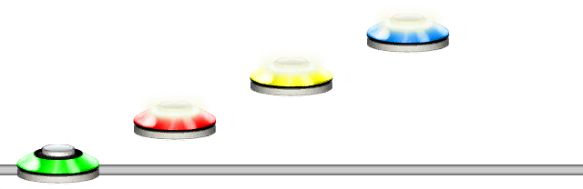

# Pattern
### Aliases
`PATTERN`, `PAT`, `P`

> [!NOTE]
> Not to be confused with the @Guides.Chart.Pattern command.

## Overview
The Pattern function will create a loadable pattern. 
Its intended use is together with Load functions.

## Arguments
| Name        | Type   | Description                            |
| ----------- | ------ | -------------------------------------- |
| PatternName | string | The name of the pattern to be created. |
| Pattern     | string | The pattern to be stored.              |

#### Example 1
```css
PAT(a,1234)LOAD(a)
```
This will create a pattern with the name "`a`" which then can be loaded with the @Guides.Unilang.Load function.



#### Example 2
```css
PAT(a,1234)PAT(b,LOAD(a)5)LOAD(b)
```
You can put Load functions and any other functions with Pattern functions.


> [!WARNING]
> Loading itself, such as doing `P(a,L(a))` is likely to cause a recursion error.