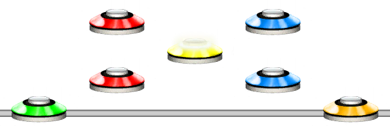
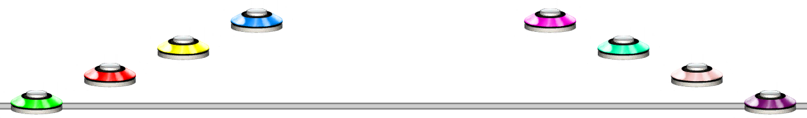

# Reflect
### Aliases
`REFLECT`, `RF`

## Overview
The Reflect function will mirror the notes around an anchor. The default anchor is 3.

## Arguments
| Name                | Type    | Description                                                                           |
| ------------------- | ------- | ------------------------------------------------------------------------------------- |
| Pattern             | string  | The pattern to reflect.                                                               |
| Anchor *(optional)* | integer | The anchor to reflect around.                                                         |

#### Example 1
```css
REFLECT(1234)
```
Reflects the four notes along the default anchor which is 3.



#### Example 2
```css
REFLECT(1234, 6)
```
Reflects the four notes along the anchor with value 6.

