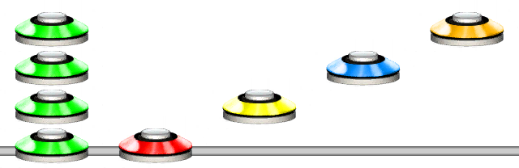
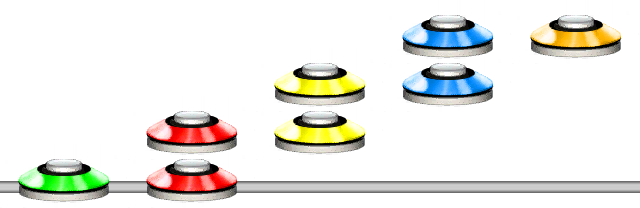

# Shorthand Chord
### Aliases
`SHORTHAND_CHORD`, `SHORTCHORD`, `SC`

## Overview
The Shorthand Chord function takes letters as input and turns them into chords. 

> [!NOTE]
> Not to be confused with the @Guides.Unilang.Letters function.

This function is functionally identical to using `.` followed by a character.

This function is quite handy if you need to write shorter Unilang code.

## Arguments
| Name                 | Type         | Description                     |
| -------------------- | ------------ | ------------------------------- |
| ChordLetters         | string       | The shorthand chord letters.    |

## List of Chords
Here is a list of what letters map to each chord. The rule is that the top note will change first.

| One note     | Two note chords                                                                                          | Three note chords | Four note chords | Five note chords |
| ------------ | -------------------------------------------------------------------------------------------------------- | ----------------- | ---------------- | ---------------- |
| `0` -> `[0]` | `a` ->  | `k` ->  | `u` ->  | `z` ->   |
| `1` -> `[1]` | `b` ->  | `l` ->  | `v` ->  |                  |
| `2` -> `[2]` | `c` ->  | `m` ->  | `w` ->  |                  |
| `3` -> `[3]` | `d` ->  | `n` ->  | `x` ->  |                  |
| `4` -> `[4]` | `e` ->  | `o` ->  | `y` ->  |                  |
| `5` -> `[5]` | `f` ->  | `p` ->  |                  |                  |
| `6` -> `[6]` | `g` ->  | `q` ->  |                  |                  |
| `7` -> `[7]` | `h` ->  | `r` ->  |                  |                  |
| `8` -> `[8]` | `i` ->  | `s` ->  |                  |                  | 
| `9` -> `[9]` | `j` ->  | `t` ->  |                  |                  |

#### Example 1
```css
SC(abcd)
```
Places the shorthand chords corresponding to the letters `a`, `b`, `c`, `d`, being `[12]`, `[13]`, `[14]`, `[15]`.



## Using Period . Characters
You can write `.` followed by one of the chord letters above to achieve the same as `SHORTHAND_CHORD()` with one letter input.

#### Example 2
```css
.a.e.h.j
```
Places the shorthand chords corresponding to the letters `a`, `e`, `h`, `j`, being `[12]`, `[23]`, `[34]`, `[45]`.



> [!TIP]
> Any chord is shorter to write using `.` notation. However, using it does come at the cost of readability.

> [!TIP]
> If you have more than 4 short hand chords, `SC(input)` notation becomes shorter than using `.` notation. 