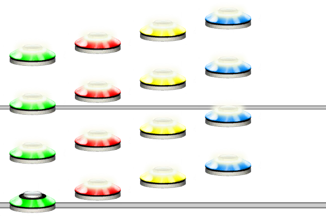
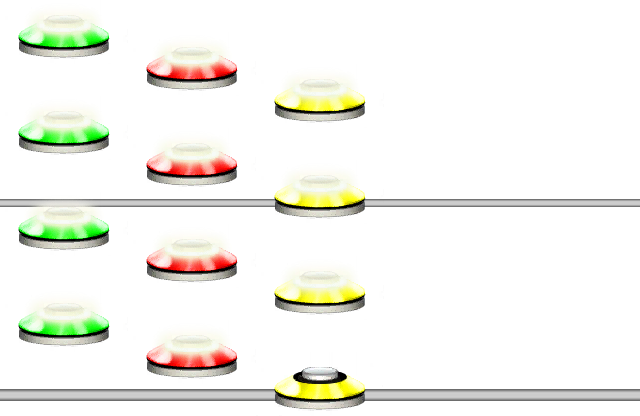

# Shorthand Quantization
### Aliases
`SHORTHAND_QUANTIZATION`, `SHORTQUANT`, `SQ`

## Overview
The Shorthand Quantization function takes a letter as input and turns it into a quantization.

This function is functionally identical to using `;` followed by a character.
This function is quite handy if you need to write shorter Unilang code.

## Arguments
| Name                    | Type         | Description                                                                           |
| ----------------------- | ------------ | ------------------------------------------------------------------------------------- |
| ShortQuantLetter        | string       | The shorthand quantization letter.                                                    |
| ShouldSnap *(optional)* | boolean      | Should the quantization snap to the nearest multiple of the value. Default is `true`. |

## List of Quantizations
Here is a list of what letters map to each quantization. The letters are grouped in multiples.

| Multiple of 2 | Multiple of 3 | Multiple of 5 | Multiple of 7 | Multiple of 9 |
| ------------- | ------------- | ------------- | ------------- | ------------- |
| `1` -> 1/1    | `a` -> 1/3    | `A` -> 1/5    | `j` -> 1/7    | `I` -> 1/9    |
| `2` -> 1/2    | `b` -> 1/6    | `B` -> 1/10   | `k` -> 1/14   | `J` -> 1/18   |
| `3` -> 1/4    | `c` -> 1/12   | `C` -> 1/20   | `l` -> 1/28   | `K` -> 1/36   |
| `4` -> 1/8    | `d` -> 1/24   | `D` -> 1/40   | `m` -> 1/56   | `L` -> 1/72   |
| `5` -> 1/16   | `e` -> 1/48   | `E` -> 1/80   | `n` -> 1/112  | `M` -> 1/144  |
| `6` -> 1/32   | `f` -> 1/96   | `F` -> 1/160  | `o` -> 1/224  | `N` -> 1/288  |
| `7` -> 1/64   | `g` -> 1/192  | `G` -> 1/320  | `p` -> 1/448  | `O` -> 1/576  |
| `8` -> 1/128  | `h` -> 1/384  | `H` -> 1/640  |               |               |
| `9` -> 1/256  | `i` -> 1/768  |               |               |               |
| `0` -> 1/512  |               |               |               |               |

#### Example 1
```css
SQ(6)ARP(1234,4)
```
Places the shorthand quantization corresponding to the character `6`, meaning 1/32, followed by 16 notes.



## Using Semicolon ; Characters
You can write `;` followed by one of the quantization letters above to achieve the same as `SHORTHAND_QUANTIZATION()`.

#### Example 2
```css
;dARP(321,4)
```
Places the shorthand quantization corresponding to the character `d`, meaning 1/24, followed by 12 notes.



## Snap Mode
As with the Quantization function you can specify the snapping mode. See the @Guides.Unilang.Quantization function for more information about snapping mode.

| Mode        | Shorthand Notation        |
| ----------- | ------------------------- |
| `FORWARDS`  | `;a` - No Extra character |
| `BACKWARDS` | `;a:` - Colon             |
| `NONE`      | `;a!` - Exclamation Mark  |

> [!TIP]
> Any quantization (within the listed quantizations) is shorter to write using `;` notation. However, using it does come at the cost of readability.