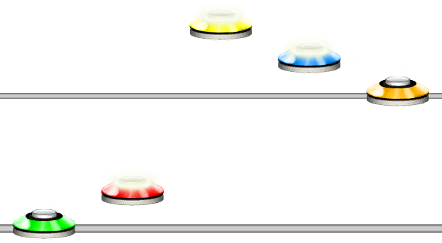
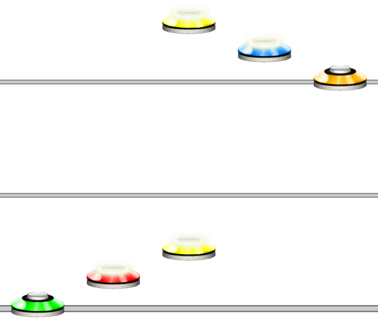

# Snap Beat
### Aliases
`SNAP_BEAT`, `SB`

## Overview
The Snap Beat function will snap to the nearest ***next*** beat. You can also specify an amount of beats to jump after snapping. Default is 0 beats.
Functionally, this is identical to using an `=` equals character.

## Arguments
| Name                   | Type        | Description                                               |
| ---------------------- | ----------- | --------------------------------------------------------- |
| JumpCount *(optional)* | integer     | The amount of beats to jump after snapping. Default is 0. |

> [!NOTE]
> If jump count is empty `SB()`, it will snap to the nearest beat and jump 0 beats, unless it is already on a beat, in which it will jump ot the ***next*** beat.

> [!TIP]
> Unlike the @Guides.Unilang.JumpStep function, this function behaves the same under any quantization.

#### Example 1
```css
12SB()543
```
This will snap to the nearest beat after the red note.



#### Example 2
```css
123SB(1)543
```
This will snap to the nearest beat and jump one beat.



## Using the = Character
Using equals `=` characters, functions identical to `SB()`.

#### Example 3
```css
12=543
```
This will snap to the nearest beat after the red note.

