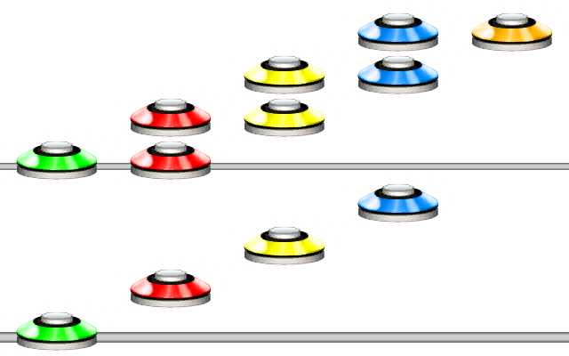

# Strum
### Aliases
`STRUM`, `S`

## Overview
The Strum function will turn all the notes within it to strums.

## Arguments
| Name        | Type        | Description                      |
| ----------- | ----------- | -------------------------------- |
| Pattern     | string      | The pattern to make into strums. |

> [!NOTE]
> The Strum function will override any internal note type mutators.

#### Example 1
```css
STRUM(1234[12][23][34][45])
```
The example shows what happens when using the Strum function.


