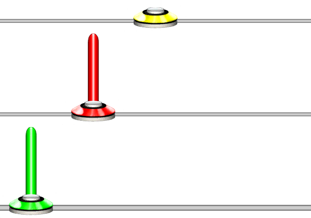

# Sustain Gap
### Aliases
`SUSTAIN_GAP`, `SUS_GAP`, `SG`

## Overview
The Sustain Gap function will set the sustain gap. The default sustain gap from the start is no sustain gap.

## Arguments
| Name                        | Type        | Description                                 |
| --------------------------- | ----------- | ------------------------------------------- |
| SustainGapStep *(optional)* | float       | The step for the sustain gap. Default is 0. | 

> [!NOTE]
> A step of 0 will set the gap to be nothing. 2 sets it to 1/2, 4 to 1/4, 32 sets it to 1/32, and so on.

#### Example 1
```css
SG(32)1{4}2{4}3
```
This will set the sustain gap to 1/32nd.

