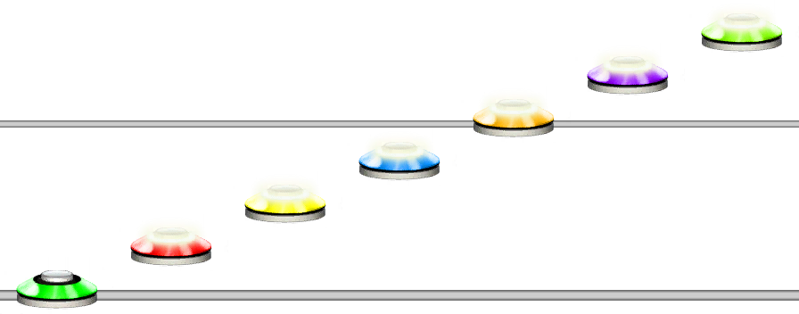
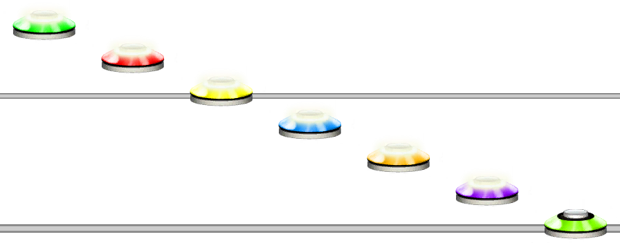

# Sweep
### Aliases
`SWEEP`, `SW`

## Overview
The Sweep function will make a sweep at the current quantization from the given start note to the given end note.

## Arguments
| Name                   | Type    | Description                                 |
| ---------------------- | ------- | ------------------------------------------- |
| StartNote *(optional)* | integer | The start note for the sweep. Default is 1. |
| EndNote *(optional)*   | integer | The end note for the sweep. Default is 5.   |

> [!NOTE]
> If StartNote is less than EndNote, the sweep will go up. If EndNote is less than StartNote, the sweep will go down.

#### Example 1
```css
SW(1,7)
```
This will create a sweep that goes from note value 1 to note value 7.



#### Example 2
```css
SW(7,1)
```
This will create a sweep that goes down from note value 7 to note value 1.



## Chords?
As with any other function, you can put the Sweep function inside of chords. This is handy if you want to make quite large chords with every note.

#### Example 3
```css
[SW(1,7)]
```
This will create a chord from a sweep of 7 notes, which makes a 7 note chord.

