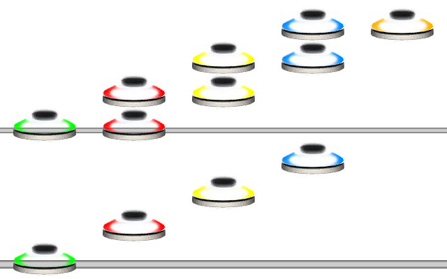

# Tap
### Aliases
`TAP`, `T`

## Overview
The Tap function will turn all the notes within it to taps.

## Arguments
| Name        | Type        | Description                    |
| ----------- | ----------- | ------------------------------ |
| Pattern     | string      | The pattern to make into taps. |

> [!NOTE]
> The Tap function will override any internal note type mutators.

#### Example 1
```css
TAP(1234[12][23][34][45])
```
The example shows what happens when using the Tap function.


