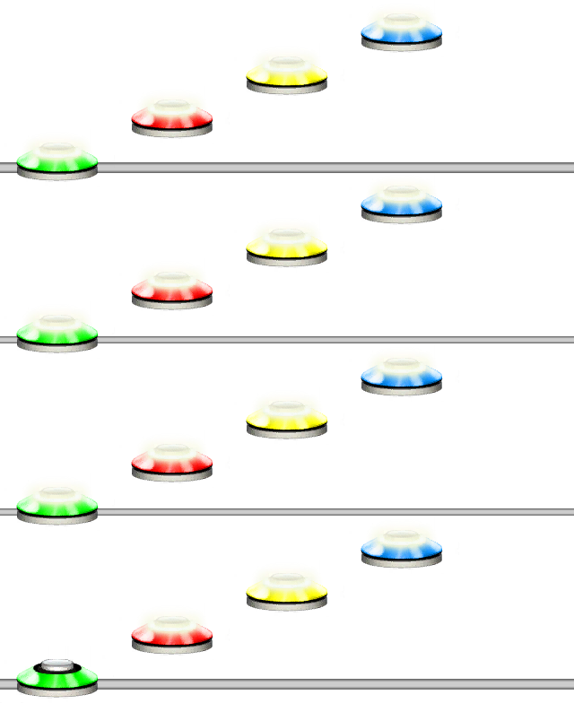

# Time Signature
### Aliases
`TIME_SIGNATURE`, `TIMESIG`, `TS`

## Overview
The Time Signature function will create a time signature at the current position.

## Arguments
| Name                     | Type    | Description                                             |
| ------------------------ | ------- | ------------------------------------------------------- |
| Numerator *(optional)*   | integer | The numerator for the time signature. Default is 4.     |
| Denominator *(optional)* | integer | The denominator for the time signature. Default is 4.   |

> [!NOTE]
> If the denominator is not a multiple of 2, it will round up to the nearest power of 2.

#### Example 1
```css
TS(3,4)ARP(1234,4)
```
This will create a 3/4 time signature at the current point.



#### Example 2
```css
TS(3,5)A(12345,3)
```
Since denominator is 5, it will round up to 8. This will then create a 3/8 time signature.

