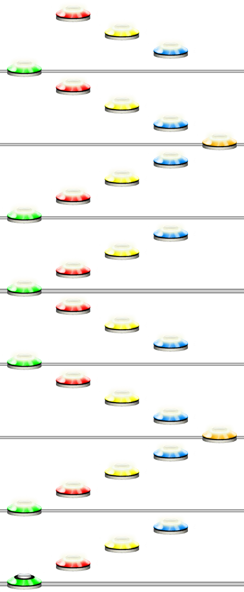

# Zig Zag
### Aliases
`ZIGZAG`, `ZAGZIG`, `ZIGZIG`, `ZAGZAG`, `ZIG`, `ZAG`, `Z`

## Overview
The Zig function is very similar to the @Guides.Unilang.Arpeggiator function in that it loops through notes.

However, the main difference to the Arpeggiator function is that it will repeat in both directions. It will go to the end then back.

> [!TIP]
> The funciton will go back and forth but will exclude the final note. So 1234 -> 123432 (notice how there is no green note at the end.)

## Arguments
| Name               | Type        | Description                                |
| ------------------ | ----------- | ------------------------------------------ |
| Pattern            | string      | The pattern to zig-zag.                    |
| Count *(optional)* | integer     | How many times to repeat it. Default is 1. |

#### Example 1
```css
ZIG(123412345, 2)
```
Will zig each note in the pattern "123412345" twice.



> [!WARNING]
> Currently this function is only partially implemented. So it wont be able to zig-zag everything like expected; quantizations currently don't work within a Zig Zag function. Full functionality is planned for a later release.